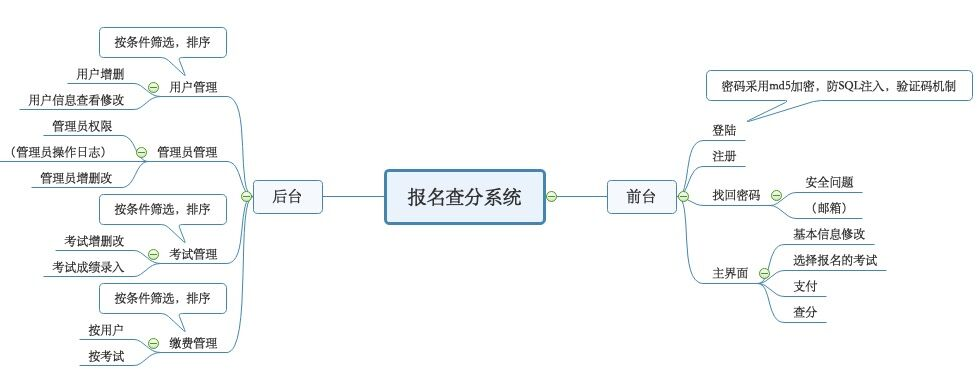

# 报名查分系统


## 基本功能模块



---
## 后端配置文件格式
server/config.js
```js
const CONF = {
    port: '3001',
    rootPathname: '',
    mysql: {
        host: 'localhost',
        port: 3306,
        user: 'root',
        db: 'SignUp4Exams',
        pass: '',
        char: 'utf8mb4'
    },
    mailSender: "",     // 邮件发送地址
    mailPassword: "",   // smtp 服务授权码
    url: "http://"      // 服务器地址，用于邮件验证
};
module.exports = CONF;
```

如需要支付回调功能正常使用，请更改tools/alipay.js中的 notifyUrl。

---
## 数据库设计
使用` node server/tools/initdbByKnex.js` 初始化数据库

users<br>
userID|email|activation|password|ActiCode

userinfo<br>
userID|username|gender|age|phone

subjects<br>
subjectID|subjectName|subjectCost|registerDeadline|examTime|subjectRule

admin<br>
id|username|password

trades<br>
outTradeId|userID|subjectName|amount|completed|payTime

{{subj1}}Subject<br>
userID|payment|score

{{subj2}}Subject<br>
userID|payment|score


## API设计

使用 Postman 导入API设置
http://rap2api.taobao.org/postman/export?id=148593


## 个人部署方法
1. git clone此源到服务器中，分别进入server文件夹与client文件夹，使用yarn install安装依赖。

2. 编辑server/config.js，在其中设置自己的数据库配置以及邮箱授权码，以及要部署的地址

3. 编辑client/src/router/index.js，设置base属性为自己要部署的path，如果直接部署在某网站根目录，则注释base属性

4. 在client文件夹中运行npm run build编译vue文件，将输出文件拷贝到nginx服务器的对应path文件夹

5. 使用node server/bin/www运行后端程序，程序默认监听于3001端口

6. 配置nginx端口转发，核心配置内容如下
```nginx.conf
location /SignUp4ExamsServer/ {
    proxy_pass http://127.0.0.1:3001/;
    proxy_http_version	1.1;
    proxy_cache_bypass	$http_upgrade;
    proxy_set_header Upgrade			$http_upgrade;
    proxy_set_header Connection 		"upgrade";
    proxy_set_header Host				$host;
    proxy_set_header X-Real-IP			$remote_addr;
    proxy_set_header X-Forwarded-For	$proxy_add_x_forwarded_for;
    proxy_set_header X-Forwarded-Proto	$scheme;
    proxy_set_header X-Forwarded-Host	$host;
    proxy_set_header X-Forwarded-Port	$server_port;
}
```

7. 此时程序应当可以正常运行
